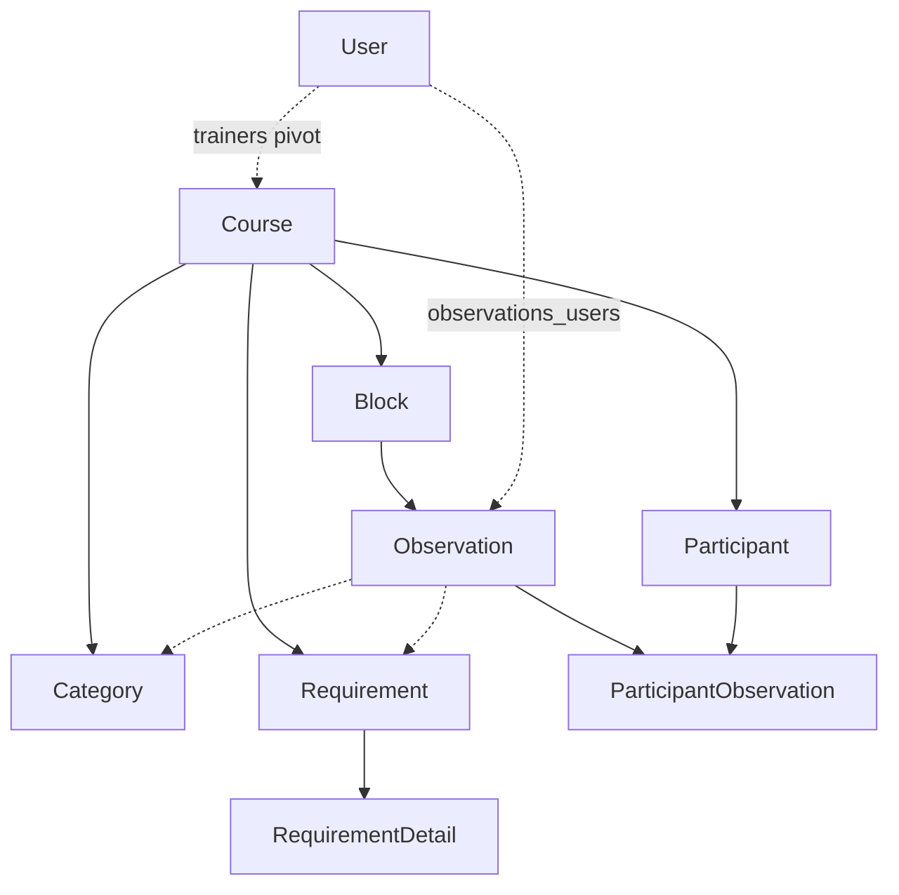
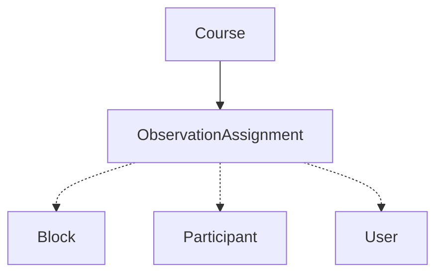
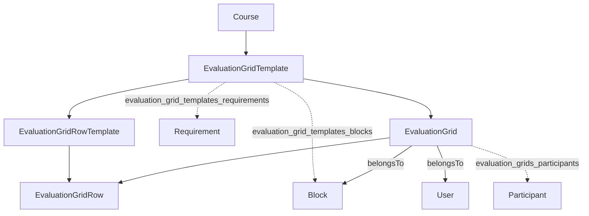
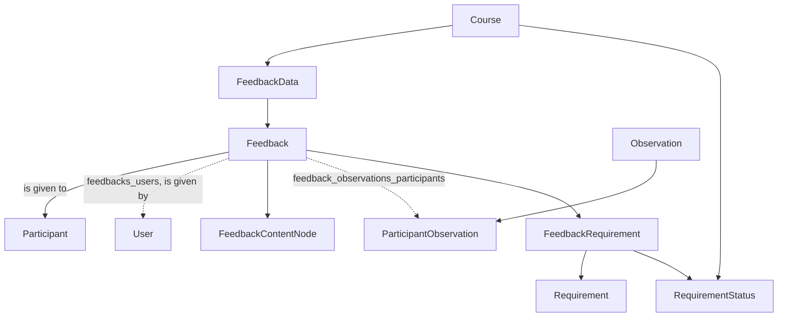

# Domain Model & Database Schema

[← Technical Documentation](../01 Technical Documentation TOC.md)

Every domain object hangs off a `Course`. Models live in [app/Models](../../app/Models); the migrations that define the tables are in [database/migrations](../../database/migrations). The canonical map of the graph is the relation list on [Course.php](../../app/Models/Course.php) — read it before adding a new nested resource. All models extend the project base [Model.php](../../app/Models/Model.php) (adds fillable-relations support), not Eloquent's `Model` directly.

## High-level graphs

## Course and its direct children

[Course.php](../../app/Models/Course.php) has `hasMany`/`hasManyThrough` relations to nearly everything:

- `participants()` → **Participant** (ordered by `scout_name`)
- `blocks()` → **Block** (a lesson; ordered by date/day/block number)
- `requirements()` → **Requirement**, `requirement_statuses()` → **RequirementStatus**, `categories()` → **Category**
- `participantGroups()` → **ParticipantGroup** (used to input observations on whole groups of participants at once, e.g. a hiking group making safety considerations or a programme planning group)
- `observationAssignments()` → **ObservationAssignment**
- `observations()` → **Observation** (`hasManyThrough` Block)
- `feedback_datas()` → **FeedbackData**, `feedbacks()` → **Feedback** (`hasManyThrough`)
- `evaluation_grid_templates()` / `evaluation_grids()` → grids (`hasManyThrough`)
- `users()` → **User** via the `trainers` pivot table (`belongsToMany`)

Booleans `uses_requirements` / `uses_categories` are *computed* accessors (`->exists()` on the relation), not columns. `default_requirement_status_id` is likewise an accessor returning the first status. Trainer membership carries pivot data on `trainers`: `last_accessed` and `last_used_block_date`.

## Observations (the core workflow)

An **[Observation](../../app/Models/Observation.php)** is a note a trainer records about one or more participants during a block:

- `belongsTo` **Block**; columns `impression` (0/1/2 → negative/neutral/positive, see the accessors on `Participant`) and `content` (max 1023 chars).
- `belongsToMany` **User** via `observations_users` (the authors) — several course team members can be recorded as having made the same observation.
- `belongsToMany` **Participant** via `observations_participants`. That join row is itself modelled as **[ParticipantObservation](../../app/Models/ParticipantObservation.php)** because feedbacks reference individual participant-observation pairs.
- `belongsToMany` **Requirement** (`observations_requirements`) and **Category** (`observations_categories`).
- Eager-loads `block, users, participants, requirements, categories` on every query (`$with`).

An **[ObservationAssignment](../../app/Models/ObservationAssignment.php)** is a *task* ("this user should observe these participants in these blocks"): `belongsToMany` **Block**, **Participant**, and **User**. It does not own observations directly; `Course::observationAssignmentsPerUserAndPerBlock()` joins assignments against actual observations to show progress.

## Requirements & qualifications

- **[Requirement](../../app/Models/Requirement.php)** — a qualification criterion (`content`, `mandatory` bool). Can be linked via `belongsToMany` to **Blocks** (`blocks_requirements`) to indicate when in the course fulfilling this criterion can likely be observed, and to **Observations**, indicating that the observation counts towards fulfilling or failing the criterion; `hasMany` **[RequirementDetail](../../app/Models/RequirementDetail.php)** (sub-points of the criterion, currently unused).
- **[RequirementStatus](../../app/Models/RequirementStatus.php)** — a per-course status label (name, `color`, `icon`) applied to a requirement within a feedback, e.g. "not observed yet", "fulfilled", "failed, but feedback conversation still pending". The allowed `COLORS` and `ICONS` are hard-coded const allowlists on the model.

See [Requirements & Qualifications](../Features/23 Requirements and Qualifications.md).

## Feedbacks

The feedback system separates shared data from per-participant records:

- **[FeedbackData](../../app/Models/FeedbackData.php)** — one feedback *round* (`name`, `course_id`); groups the feedbacks handed out together.
- **[Feedback](../../app/Models/Feedback.php)** — one participant's feedback: `belongsTo` FeedbackData + Participant, `belongsToMany` **User** (assigned trainers, `feedbacks_users`). On creation it generates a random `collaborationKey` (used for real-time editing). Its `name`/`display_name` are proxied from FeedbackData.
- A **Feedback** has a rich text body for planning, carrying out or recording a feedback conversation. This text can embed some of the models, and is stored as ordered rows of `json` rather than one blob, so DB relations (e.g. to requirements) can be enforced. The `contents` attribute round-trips these nodes through `TiptapFormatter`.
  - **[FeedbackContentNode](../../app/Models/FeedbackContentNode.php)** — a piece of rich-text body, with optional formatting.
  - **[FeedbackRequirement](../../app/Models/FeedbackRequirement.php)** — embedding a **Requirement** in a feedback text body with a chosen **RequirementStatus**, plus `order` and `comment` (not printed, for internal notes among the course trainers).
  - A Feedback can embed specific **ParticipantObservation** rows via `feedback_observations_participants` (ordered), i.e. which observations back this feedback.

See [Feedback System & Collaborative Editing](../Features/24 Feedback System and Collaborative Editing.md) and [Feedback Allocation Algorithm](../Features/25 Feedback Allocation Algorithm.md).

## Evaluation grids

Two parallel hierarchies — template vs. instance:

- **[EvaluationGridTemplate](../../app/Models/EvaluationGridTemplate.php)** — a rubric definition for a course. `hasMany` **[EvaluationGridRowTemplate](../../app/Models/EvaluationGridRowTemplate.php)** (ordered rows, each with a `control_type` from `['slider','radiobuttons','checkbox','heading','notes_only']`); `belongsToMany` **Requirement** and **Block**, since an evaluation grid is conceptually similar to a more structured observation.
- **[EvaluationGrid](../../app/Models/EvaluationGrid.php)** — a filled-in instance: `belongsTo` template, **Block**, **User**; `belongsToMany` **Participant**. `hasMany` **[EvaluationGridRow](../../app/Models/EvaluationGridRow.php)** (`value` + `notes`, each tied to a row template and ordered by the template's `order`).

See [Evaluation Grids](../Features/22 Evaluation Grids.md).

## Notable constraints & conventions

- **Ordering is enforced in the relations**, not the schema: blocks and everything ordered "by block" repeatedly sort on `block_date, day_number, block_number, name, id`.
- **Join tables are first-class where needed**: `ParticipantObservation`, `FeedbackRequirement`, and the row/template pairs are real models because other tables reference them or carry extra columns (`order`, `comment`, `value`).
- **Computed columns** like `full_block_number` (day.block) and `blockname_and_number` are accessors on [Block.php](../../app/Models/Block.php), not stored; `day_number`/`block_number` are the stored parts.
- **Participant deletion** cascades to orphan observations via `DeleteOrphanObservationsOnParticipantDelete` (registered as an observer in [AppServiceProvider](../../app/Providers/AppServiceProvider.php)).
- The **`users` table is single-table inheritance** (see [Authentication & Authorization](../Architecture/14 Authentication and Authorization.md)).
