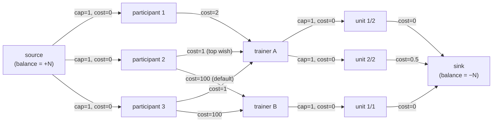

# Feedback Allocation Algorithm

[← Technical Documentation](../01 Technical Documentation TOC.md)

When a [feedback round](../Features/24 Feedback System and Collaborative Editing.md) is prepared, each participant's feedback must be assigned to a trainer (course leader) who will write it. Participants may express ranked wishes for which trainer they'd like, trainers have a limited capacity (how many feedbacks they can take), and some participant↔trainer pairings can be disabled due to personal preferences. The allocator finds an assignment that respects capacities and forbidden pairings while honoring wishes as much as possible.

This is solved as a **min-cost max-flow** problem.

## Interface

[`app/Services/FeedbackAllocation/FeedbackAllocator.php`](../../app/Services/FeedbackAllocation/FeedbackAllocator.php):

```php
public function tryToAllocateFeedbacks(
    array $trainerCapacities,        // [ [trainerId, capacity], ... ]
    array $participantPreferences,   // [ [participantId, wish1, wish2, ...], ... ]  (wishes are trainerIds or null)
    int   $numberOfWishes,           // how many ranked wishes each participant may have
    array $forbiddenWishes,          // [ [participantId, trainerId], ... ]
    int   $defaultPriority = 100,    // cost assigned to a non-wished pairing
    bool  $unweighted = false        // treat all wishes as equal priority
): array;                            // [ ['trainerIdent' => id, 'participantIdents' => [ids]], ... ]
```

## Implementation: `DefaultFeedbackAllocator`

[`app/Services/FeedbackAllocation/DefaultFeedbackAllocator.php`](../../app/Services/FeedbackAllocation/DefaultFeedbackAllocator.php) builds a flow network with `graphp/graph` and solves it with `graphp/algorithms`' `SuccessiveShortestPath` (min-cost flow) and `Flow`.

### Graph construction (`createGraphFromInput`)



In principle, every participant connects to every trainer (`cap=1`, `cost` = that pairing's priority). Here participant 1 has **no** edge to trainer B — that pairing is forbidden, so no edge is created and the assignment can never route through it. The min-cost flow picks one outgoing edge per participant so that trainer capacities (`trainer A` ≤ 2, `trainer B` ≤ 1) hold and the total cost — i.e. the sum of granted-wish priorities — is minimal.

- **Source** (vertex `0`, balance `+N`) and **sink** (vertex `1`, balance `−N`), where `N` = participant count. This forces a flow of exactly `N` units — one per participant.
- **Source → participant**: capacity `1`, cost `0`. Each participant sends exactly one unit of flow (gets exactly one trainer).
- **Participant → trainer**: capacity `1`, cost = the pairing's priority. Costs are held in a `preferenceMatrix` initialized to `defaultPriority` for every pair, then:
  - each of a participant's ranked wishes lowers the cost for that trainer to `min(currentCost, weight)`, where `weight` is the wish rank (`priority`, 1 = top wish) — or `1` when `unweighted`. Lower cost = more preferred.
  - forbidden pairings are set to `PHP_INT_MAX` and **no edge** is created for them, making the assignment impossible.
- **Trainer → unit → sink**: each trainer's `capacity` is split into `capacity` unit vertices (`trainer → unit`: `cap=1, cost=0`; `unit → sink`: `cap=1`, cost = `unitIndex / capacity`, 0-indexed). This makes the *marginal* cost of the trainer's `k`-th assignment grow with how busy the trainer already is (proportionally, not in absolute terms — a trainer with capacity 4 and one already assigned is *less* busy, and thus cheaper to assign to next, than a trainer with capacity 2 and one already assigned). Since these per-unit costs are always `< 1` and real preference costs are integers that differ by at least `1`, this can only break ties between otherwise equally-good trainers — it never overrides a genuine wish/default priority difference. It's implemented with per-unit intermediate vertices rather than parallel `trainer → sink` edges because `graphp`'s min-cost-flow solver doesn't support parallel edges between the same vertex pair.

Vertex IDs are laid out deterministically: participants at `index + 2`, trainers at `participantCount + index + 2`, and the per-trainer unit vertices following after all trainers, with lookup maps between vertex IDs and the original trainer/participant identifiers (unit vertices are purely internal — assignments are read back directly off each trainer vertex's incoming edges, see `getAssignments`, so they never need a name lookup).

### Solving (`calculateMaxFlowMinCost`)

1. `SuccessiveShortestPath::createGraph()` computes the minimum-cost flow.
2. `Flow::getFlowVertex($source)` reads back the achieved flow.
3. If the flow equals `N`, every participant was assigned → extract assignments; otherwise the demand couldn't be met.

`getAssignments` walks edges into the sink, then for each trainer walks its incoming edges with positive flow to collect the assigned participants, returning `[ ['trainerIdent' => …, 'participantIdents' => […]], … ]`.

### Failure handling

If the flow is incomplete (insufficient total capacity, or forbidden pairings make it infeasible) the code throws, and `calculateMaxFlowMinCost` catches it and raises `FeedbackAllocationException` with a translation key — `t.views.admin.feedbacks.allocation.errors.allocation_failed` for the known "not enough capacity" / unsolvable cases, or `...errors.unexpected` for anything else (also logged via `Log::error`).

## Wiring

[`FeedbackController::allocate`](../../app/Http/Controllers/FeedbackController.php) (route `admin.feedbacks.allocate`) type-hints the `FeedbackAllocator` interface (resolved to `DefaultFeedbackAllocator` by the container), validates the request with [`FeedbackAllocationRequest`](../../app/Http/Requests/FeedbackAllocationRequest.php), calls `tryToAllocateFeedbacks`, and returns the assignment array as the response. `FeedbackAllocationException` is converted into a validation error on the `allocation` field.

`FeedbackAllocationRequest` enforces the input shapes above (e.g. `trainerCapacities.*` is a 2-element `[id, capacity]` array with `capacity >= 0`; `forbiddenWishes` is `present` but may be empty; `defaultPriority` defaults to `100` via `prepareForValidation`).

The preference-collection UI is served by `FeedbackController::preference` (route `admin.feedbacks.preferences`); the computed assignments (with optional manual modifications by the user via the UI) are applied to feedbacks via `admin.feedbacks.assignments.update`. See [Feedback System](../Features/24 Feedback System and Collaborative Editing.md) for how assignments attach trainers to feedbacks (`feedbacks_users`).

## Frontend

[`resources/js/components/feedback/allocation/FormFeedbackAllocation.vue`](../../resources/js/components/feedback/allocation/FormFeedbackAllocation.vue) collects trainer capacities, participant wishes and forbidden pairings and posts them to the allocate endpoint, renders the generated allocation, allows the user to modify it to taste and allows to save the final allocations.
